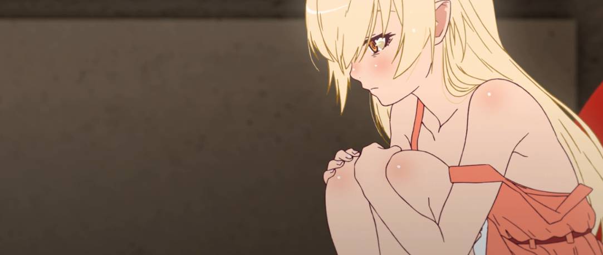

# shinobu


<p align="center">
  
</p>


#### Current version: `1.1.1`

## What can this bot do?

Renge can do several things, she can play music, answer your questions, ban/kick people, assign roles to people etc...

Here is a full list of what she does:

```xl
If you need any help feel free to contact NyanpasuOWO#2834

COMMANDS ANYONE CAN USE:
.role your role : "Assigns the mentioned role"
.8ball your question? : "Answers your weirdest questions"
.mal yourMalUsername : "Posts a link to your MAL profile".
.twitter yourTwitterUsername : "Posts a link to your twitter profile"
.avatar : "Sends a direct link to your avatar"
.join : "Join Voice channel of message sender"
.add : "Add a valid youtube link to the queue"
.queue : "Shows the current queue, up to 15 songs shown."
.play : "Play the music queue if already joined to a voice channel"

THE FOLLOWING COMMANDS ONLY FUNCTION WHILE THE PLAY COMMAND IS RUNNING:
.pause : "pauses the music"
.resume : "resumes the music"
.skip : "skips the playing song"
.time : "Shows the playtime of the song."
volume+(+++) : "increases volume by 2%/+"
volume-(---) : "decreases volume by 2%/-"


COMMANDS FOR ADMINS/MODS ONLY:
.kick @member : "kicks the mentioned user"
.ban @member : "bans the mentioned user"
.purge ### : "Deletes up to 100 messages."

```


